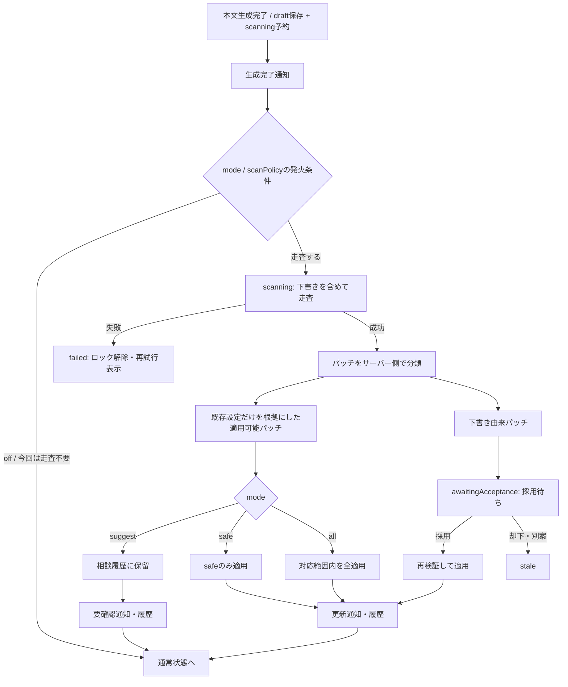

# 生成通知・自動設定更新・文体変調 設計書

作成日: 2026-07-22
対象バージョン: 0.1.0-beta.8 予定
実装完了日: 2026-07-23
実装後の扱い: 実装完了後 `archive/` へ移動する。

## 0. 背景

長文生成では、生成を待つあいだにアプリから視線を外すことが多い。一方、現在の ChapterFlow は生成中表示を画面内に出すだけで、本文の出力開始・完了・失敗を音やシステムポップアップで知らせる仕組みを持たない。

また、既存の作品設定レビューには以下の機能がある。

- 世界設定・人物設定・システムプロンプト・物語状態の横断走査
- AIとの作品設定相談
- world / characters に対する差分パッチ
- パッチの適用・却下と相談履歴

ただし、走査とパッチ適用はユーザーの明示操作が必要であり、本文生成後の空き時間を使って自動的に整合性を確認することはできない。

文章表現については、文体見本とプリセット、直近本文の頻出フレーズを弱く避ける仕組みがある。しかし、感覚経路・冒頭型・反応型・文末の着地・比喩核など、語句より上位の「書き方の型」が連続することで、文章が平板かつ紋切り型になる問題が残る。

本設計書では、以下3トラックを一体として設計する。

1. **生成通知**: 最初の本文到着・生成完了・失敗・自動設定更新を、音、システムポップアップ、アプリ内通知で知らせる。
2. **生成後の自動設定レビュー**: 生成直後の本文を含めて走査し、設定に応じて提案・安全な自動適用・全自動適用を行う。
3. **文体変調**: 作品固有の文体を保ったまま、場面ごとの感覚レンズと既出型の減衰によって小さな傾きを与える。

---

## 1. 設計上の決定事項

### 1.1 設定スコープを分離する

- 通知は利用者の端末・アプリに対する好みなので、**アプリ全体設定**に保存する。
- 自動設定レビューは作品データを変更するため、**作品ごとの設定**に保存する。
- 文体変調は作品の文体に属するため、**作品ごとの設定**に保存する。

### 1.2 走査開始と設定確定を分ける

- 走査は `scanPolicy` の発火条件を満たす本文生成の完了直後に開始し、生成された下書きも入力へ含める。毎生成の走査は `always` で選べる。
- 生成直後の本文は `draft` であり、採用済みの正史ではない。
- 下書きだけを根拠にしたパッチは、対応する生成案が採用されるまで適用しない。
- 下書きが却下された、別案へ切り替わった、または削除された場合、その下書き由来パッチは `stale` にする。
- 既存設定と採用済み本文だけを根拠にしたパッチは、下書きの採否に依存しない。

### 1.3 本文生成中の設定変更は禁止する

生成プロンプトは生成開始時点の設定スナップショットから構築する。本文ストリーミング中に world / characters を変更しても、その変更は生成中の応答には反映されず、監査上も「どの設定で書かれた本文か」が曖昧になる。

したがって、自動走査ジョブは生成完了後に開始する。自動パッチ適用も生成ロック解放後に行い、変更は次回生成から有効とする。

### 1.4 全自動でも技術的ガードは外さない

「すべて自動適用」は、対応範囲内の意味的に高リスクな提案も自動適用するモードである。ただし、以下はモードに関係なく適用を拒否する。

- 走査時点から対象データの revision / hash が変わっている
- world のアンカーが 0 件または複数件一致する
- 対象人物が存在しない、または ID が競合する
- スキーマ検証・正規化に失敗する
- 未採用下書きだけを根拠にしている
- 自動化の対応範囲外である
- 同一生成 ID に対して既に自動走査・適用済みである

### 1.5 全自動モードには監査導線と取り消しを必須とする

全自動モードだけを先行提供しない。以下が同時に成立して初めて全自動を有効化できる。

- 変更前後、根拠、対象生成 ID、使用モデルを履歴に残す
- 高リスク変更時は消えるだけのトーストではなく、要確認通知を残す
- 通知クリックで既存の作品設定相談を開き、該当更新へ移動する
- 最新の自動更新単位を一括で取り消せる
- 取り消し後も履歴自体は削除しない

### 1.6 文体変調は「本人性」と「今回の傾き」を分ける

- 文体見本、人称、視点、語彙の格調、基本リズム、人物の口調は **文体DNA** として固定する。
- 視覚・聴覚・身体感覚・内省・運動・対話・時間感覚は **今回のレンズ** として小さく動かす。
- 最近使われた語句・感覚イメージ・冒頭型・反応型・着地型は、禁止ではなく **弱い減衰** をかける。
- 文体DNAと文体変調が競合した場合は、常に文体DNAを優先する。

---

## 2. 対象コード

### 2.1 既存変更対象

- `src/shared/types.ts`
  - 通知設定、自動レビュー設定、メンテナンス状態、パッチ監査情報、文体変調設定・実績
- `src/server/services/appSettingsService.ts`
  - アプリ全体の通知設定の読み書き・正規化
- `src/server/services/generationService.ts`
  - 生成完了後ジョブの起動、生成ガード、採用・却下との連携
- `src/server/services/refineScanService.ts`
  - 最新生成本文とスナップショットを含む自動走査
- `src/server/services/refineChatService.ts`
  - 自動生成パッチ、リスク分類、適用、履歴、取り消し
- `src/server/services/storageService.ts`
  - 自動レビュー状態、専用 `refineAutomation.json`、文体トレースの保存
- `src/server/prompts/promptBuilder.ts`
  - 文体DNA、今回のレンズ、表層・型の減衰の注入
- `src/server/routes/generate.ts`
  - 更新中の生成拒否、自動レビュー状態の応答
- `src/server/routes/refine.ts`
  - 自動レビュー設定・状態・履歴・取り消し API
- `src/server/routes/models.ts` またはアプリ設定用ルート
  - 通知設定 API
- `src/client/clientApi.ts`
  - 通知設定、自動レビュー、取り消し、状態取得 API
- `src/client/App.tsx`
  - アプリ共通通知、通知クリック時の画面遷移ターゲット
- `src/client/components/AppSettingsPanel.tsx`
  - 通知設定 UI
- `src/client/components/Reader.tsx`
  - 最初の chunk、完了、失敗の通知、自動更新状態、送信ボタン制御
- `src/client/components/WorkSettingsTab.tsx`
  - 自動レビュー設定、文体変調設定、該当履歴へのフォーカス
- `src/client/components/RefineChatPanel.tsx`
  - 自動更新履歴、リスク表示、根拠、取り消し、相談への接続
- `src/client/components/RoleplayWorkspace.tsx`
  - 生成通知の共通化のみ。自動設定レビュー・文体変調は本フェーズ対象外
- `src/client/components/SetupWorkspace.tsx`
  - 相談応答通知の共通化のみ。自動設定レビュー・文体変調は本フェーズ対象外

### 2.2 新規モジュール候補

- `src/client/services/notificationService.ts`
  - 音、Web Notification、フォーカス判定、重複抑止
- `src/server/services/postGenerationMaintenanceService.ts`
  - 生成後走査・適用・採用待ち・ループ防止を統括
- `src/server/services/refineRiskPolicy.ts`
  - AIの自己申告とは独立したサーバー側リスク分類
- `src/server/services/styleVariationService.ts`
  - 文体レンズ選択、seed、減衰、実績記録

ファイル名は実装時に既存責務との釣り合いを見て調整してよい。ただし、通知・自動レビュー・文体変調を `Reader.tsx` や `generationService.ts` のローカル関数だけで抱え込ませない。

---

## 3. 前提となる現状仕様

- 小説本文は、非ストリーミングでは `generateScene`、ストリーミングでは `generateSceneStream` が生成する。
- 生成結果はまず `GenerationRecord.status = 'draft'` として保存される。
- `acceptGeneration` で採用されたあと、物語状態の非同期更新が始まる。
- 本文生成・採用・refine patch 適用は `withProjectWriteLock` によって作品単位で直列化される。
- refine scan の結果は `refineScan.json`、相談とパッチは `refineSession.json` に保存される。
- refine patch の現行対応範囲は world / characters。system prompt は走査対象だが、自動パッチ対象ではない。
- `RefinePatch` は `pending / applied / rejected / stale` を持つが、現在は自動化 run、リスク、根拠スコープ、取り消しスナップショットを持たない。
- `promptBuilder` は直近本文から頻出フレーズを抽出し、登録NGとは別の弱い注意としてプロンプトへ渡している。
- `styleSample` は最大 1000 字の文体見本として使われ、文体・リズム・描写密度ではプリセットより優先される。
- アプリ設定は `app-settings.json` に保存されるが、現状は通知設定を持たない。

---

## 4. 全体アーキテクチャ

### 4.1 生成後メンテナンスの状態遷移



### 4.2 ブロッキング方針

以下の phase では、新しい本文生成、別案、書き直しを拒否する。

- `scanning`
- `applying`
- `reverting`

`awaitingAcceptance` はモデル処理も書き込みも行っていないため、更新中ロックには含めない。ただし、対応する下書きが別案生成・却下された場合は保留パッチを即座に `stale` にする。

本文生成の保存と自動走査の予約は分離しない。`draft`、`selectedDraftGenerationId`、新しい `runId`、`refineMaintenance.phase = 'scanning'` を、生成処理が保持している同じ project write lock と同じ `writeState` で原子的に保存してからロックを解放する。モデル走査jobはロック解放後に起動するが、保存済み `runId` と現在の maintenance slot が一致する場合だけ処理を続行する。これにより「draft保存済みだがscanning未確定」の隙間を作らず、別generationのrunによる単一スロットの上書きを防ぐ。

新しい生成・書き直し・別案を開始するとき、既存の `awaitingAcceptance` が現在の選択下書きに属さない、またはその操作によって選択下書きでなくなる場合は、同じ project write lock 内で旧runを監査履歴へ `stale` として退避し、active slotを解放してから新しいrunを予約する。放置中の `awaitingAcceptance` は生成をブロックせず、active slotを恒久的に占有しない。

UI だけでなく生成 API 側も 409 を返す。エラーコードは `post_generation_maintenance_in_progress` とし、クライアントは一般エラーではなく状態再取得へ誘導する。

ストリーミングルートは現状、サービス呼び出し前に SSE の 200 ヘッダーを送るため、メンテナンス preflight を `res.writeHead` より前に行う。preflight 後の競合を防ぐためサービス層でも同じ条件を再検証し、ヘッダー送信後の狭い競合窓で拒否された場合だけ SSE `error` イベントへ縮退する。非ストリーミングは通常の HTTP 409、ストリーミングは原則 preflight の HTTP 409 とし、race 時の SSE error もクライアントが同じ更新中状態として扱う。

自動runが合成表示用メッセージを追記する `RefineSession` に対し、手動走査・相談送信・パッチ適用・却下も書き込みを行うため、`scanning / applying / reverting` 中はこれらを無効化する。監査run本体は専用storeへ分離しても、サーバー側では同じ作品の自動runと手動refine操作を共通ロックで直列化し、双方が別のsession revisionを保存するlost updateを防ぐ。

### 4.3 採用時の処理順

下書き由来パッチがある場合、採用とパッチ適用を同じ関数のネストしたロック内で行わない。処理順は次の通り。

1. 対象 generation が現在の選択下書きであることを確認する。
2. `acceptGeneration` は既存どおり project lock の中で generation を accepted にする。同じロック内で、story state refresh の起動担当を `accept` または `maintenance` のどちらか一方に確定する。対応する自動runがある場合は永続的な「メンテナンス継続待ち」を記録し、担当を `maintenance` にして project lock を解放する。
3. メンテナンス統括が **session lock → project lock** の順で取得する。
4. 自動レビューパッチの revision / hash / evidence を再検証する。
5. 適用可能なパッチを world / characters へ反映し、run / session を保存して両ロックを解放する。
6. 既存の story state refresh を起動する。

これにより、採用本文から story state を抽出するときには、自動レビューで確定した人物・世界設定を参照できる。パッチ適用が失敗しても本文採用は取り消さず、設定更新を `failed` として履歴へ残し、story state refresh は続行する。

現行 `acceptGeneration` は採用直後に `startStoryStateRefreshAfterAcceptance` を呼ぶため、自動走査中に採用された場合は起動をメンテナンス統括へ委譲する。採用API自体は generation を accepted にして応答してよいが、対応する走査が完了または失敗するまで story state refresh を開始しない。走査が失敗した場合も、story state refresh は必ず起動する。起動担当の判断はproject lock外で再判定せず、永続化した担当だけを正本とする。

現行手動 `applyRefinePatch` も session lock → project lock の順である。自動runもこの順序へ統一し、accept側から session lock を取得しない。`accept / manual apply / auto apply` の並行テストで相互待ちがないことを検証する。

メンテナンス統括は、ロックを取得する公開関数である `acceptGeneration` / `applyRefinePatch` を、ロック保持中または統括処理の内側から呼ばない。採用、パッチ適用、refresh予約は `*Unlocked` 相当の内部処理へ分離し、公開関数同士の入れ子取得を禁止する。プロセス再起動でin-process jobが失われても、採用時に永続化された継続待ちを検出し、accept完了後にメンテナンス統括を再開する。対象runが失敗・staleになった場合も、担当が `maintenance` なら最後にrefreshを一度だけ起動する。

---

## 5. データモデル

以下は概念スキーマであり、実装時の型名は既存命名に合わせてよい。

### 5.1 アプリ全体の通知設定

```ts
interface GenerationNotificationSettings {
  soundEnabled: boolean;
  systemPopupEnabled: boolean;
  onlyWhenUnfocused: boolean;
  events: {
    firstOutput: boolean;
    completed: boolean;
    failed: boolean;
    settingsUpdated: boolean;
    reviewRequired: boolean;
  };
}

interface AppSettings {
  // existing fields...
  generationNotifications?: GenerationNotificationSettings;
}
```

既存利用者へ突然音やOS通知を出さないため、未設定時の既定値は以下とする。

```ts
{
  soundEnabled: false,
  systemPopupEnabled: false,
  onlyWhenUnfocused: true,
  events: {
    firstOutput: true,
    completed: false,
    failed: true,
    settingsUpdated: true,
    reviewRequired: true,
  }
}
```

`events` は音・システムポップアップ双方に共通する。`soundEnabled` と `systemPopupEnabled` は独立しているため「ポップアップだけ」は選べるが、イベントごとに通知チャネルを分ける設定は本フェーズでは持たない。

アプリ内通知は監査の正本でもあるため、`reviewRequired = false` でも、`all` モードでreview patchを自動適用した場合、および適用・取消・整合性検証が失敗した場合だけは表示する。通常の保留提案通知まで設定を無視して表示してはならない。

### 5.2 作品ごとの自動レビュー設定

```ts
type RefineAutomationMode = 'off' | 'suggest' | 'safe' | 'all';
type RefineAutomationScanPolicy = 'when-needed' | 'always';

interface RefineAutomationSettings {
  mode: RefineAutomationMode;
  scanPolicy: RefineAutomationScanPolicy;
}

interface Project {
  // existing fields...
  refineAutomation?: RefineAutomationSettings;
}
```

既定値は以下とする。

```ts
{
  mode: 'safe',
  scanPolicy: 'when-needed',
}
```

既存作品では機能追加直後からモデル呼び出し回数が増えるため、移行時だけは `refineAutomation` 欠損を `off` と解釈し、ユーザーが初めて設定画面を保存した時点で `safe / when-needed` を選択状態として提示する。新規作品は `safe / when-needed` を既定保存する。

`when-needed` は本文生成後、次のいずれかに該当するときだけ走査する。

- 現在の `AUTOMATION_SCHEMA_VERSION` で成功runがまだない
- 前回成功runから static hash または story state revision が変化した
- refine review status が設定・物語進行のdriftを示している
- 前回成功run以降に採用済みgenerationが3件以上増えた

`always` は生成のたびに走査する。UIでは追加モデル呼び出しが毎回発生することを明記する。`suggest`へ変えても走査コスト自体は減らないため、モードと走査頻度は別設定とする。`mode = 'off'` の場合は `scanPolicy` にかかわらず走査しない。

### 5.3 自動レビュー状態

```ts
type RefineMaintenancePhase =
  | 'scanning'
  | 'awaitingAcceptance'
  | 'applying'
  | 'reverting'
  | 'complete'
  | 'needsReview'
  | 'stale'
  | 'failed';

interface RefineMaintenanceStatus {
  runId: string;
  generationId: GenerationId;
  phase: RefineMaintenancePhase;
  startedAt: string;
  updatedAt: string;
  leaseExpiresAt: string;
  appliedPatchIds: string[];
  pendingPatchIds: string[];
  reviewPatchIds: string[];
  postAcceptanceContinuation?: {
    generationId: GenerationId;
    action: 'story-state-refresh';
    owner: 'maintenance';
    requestedAt: string;
  };
  errorMessage?: string;
}

interface ProjectState {
  // existing fields...
  refineMaintenance?: RefineMaintenanceStatus;
}
```

`complete / needsReview / stale / failed` は直近結果表示用であり、生成をブロックしない。一定件数を越えた履歴は監査 run 側へ残し、`ProjectState` には最新状態だけを持つ。

`postAcceptanceContinuation` が存在する場合、story state refreshの起動担当は `maintenance` である。存在しない採用では `acceptGeneration` がproject lock解放後に起動する。両方が起動権を持つ状態は作らない。

### 5.4 パッチの監査情報

```ts
type RefineRiskLevel = 'safe' | 'review';
type RefineEvidenceScope = 'static' | 'accepted' | 'draft' | 'mixed';
type RefinePatchOrigin = 'manual-chat' | 'manual-scan' | 'auto-scan';

interface RefinePatch {
  // existing fields...
  origin?: RefinePatchOrigin;
  automationRunId?: string;
  sourceGenerationId?: GenerationId;
  riskLevel?: RefineRiskLevel;
  riskReasons?: string[];
  evidenceScope?: RefineEvidenceScope;
  sourceStaticHash?: string;
  sourceStoryStateUpdatedAt?: string | null;
}
```

古いパッチにはこれらが存在しない。欠損時は `origin = 'manual-chat'`、`riskLevel = 'review'` として扱う。

### 5.5 自動更新 run と取り消し

```ts
interface RefineAutomationRun {
  schemaVersion: 1;
  runId: string;
  generationId: GenerationId;
  status: RefineMaintenancePhase;
  mode: RefineAutomationMode;
  usedModel: { provider: string; modelName: string };
  createdAt: string;
  completedAt?: string;
  sourceStaticHash: string;
  sourceStoryStateUpdatedAt?: string | null;
  sourceAcceptedGenerationCount: number;
  patchIds: string[];
  appliedPatchIds: string[];
  pendingPatchIds: string[];
  reviewPatchIds: string[];
  highRiskAppliedPatchIds: string[];
  acknowledgement?: 'pending' | 'acknowledged' | 'reverted';
  revertedAt?: string;
  revertError?: string;
  beforeSnapshot?: {
    worldText: string;
    characters: Character[];
  };
  resultStaticHash?: string;
}

interface RefineAutomationStore {
  schemaVersion: 1;
  runs: RefineAutomationRun[];
}
```

- run、パッチ監査情報、`beforeSnapshot` は作品ごとの専用 `refineAutomation.json` に保存する。`refineSession.json` へsnapshotやrun配列を埋め込まない。
- `RefineSession` には `automationRunId` を持つ軽量なsystem messageまたはrun参照だけを置き、画面表示時に専用storeと合成する。
- 履歴本文の最大24メッセージ切り詰めとは別に、run 監査記録は最大50件保持する。
- `beforeSnapshot` は未取り消しの新しい5 run まで保持する。
- 取り消せるのは、現在データの hash がその run の `resultStaticHash` と一致する最新 run だけとする。
- 取り消しは run 単位で原子的に行い、個々のAI生成 inverse patchには依存しない。

`all` で `review` patch を適用した run は `acknowledgement = 'pending'` とし、ユーザーが確認または取り消すまで次のrunの自動適用を停止する。次のrunの走査・提案作成は許可するが、パッチは保留する。これにより高リスクrunが常に最新の適用runとなり、後続runによって取り消せなくなることを防ぐ。確認後は `acknowledgement = 'acknowledged'`、取り消し後は `reverted` とする。

### 5.6 文体変調設定

```ts
type StyleAxis =
  | 'visual'
  | 'auditory'
  | 'somatic'
  | 'introspective'
  | 'kinetic'
  | 'dialogic'
  | 'temporal';

interface StyleVariationSettings {
  enabled: boolean;
  intensity: 'subtle' | 'balanced';
  axisWeights: Partial<Record<StyleAxis, number>>; // 0.0 - 1.0
  surfaceDecayEnabled: boolean;
  patternDecayEnabled: boolean;
}

interface Project {
  // existing fields...
  styleVariation?: StyleVariationSettings;
}
```

既定値は `enabled = false`、`intensity = 'subtle'`。有効化時の軸重みは全軸 0.5 とし、選択履歴と場面条件で毎回小さく傾ける。

### 5.7 生成ごとの文体実績

```ts
interface GenerationStyleProfile {
  schemaVersion: 1;
  seed: string;
  primaryAxis: StyleAxis;
  secondaryAxis?: StyleAxis;
  entryChannel?: 'visual' | 'pressure' | 'temperature' | 'sound' | 'distance';
  attenuatedPatterns: string[];
  intensity: 'subtle' | 'balanced';
}

interface GenerationRecord {
  // existing fields...
  styleProfile?: GenerationStyleProfile;
}
```

- `continue`: 新しい profile を選ぶ。
- `regenerate`: 書き直し対象の profile を再利用する。
- `variate`: 新しい seed と profile を選ぶ。
- 設定無効時および既存 generation では `styleProfile` は未定義。

---

## 6. トラックA: 生成通知

### 6.1 通知イベント

| イベント | 発火条件 | 重複防止キー | 備考 |
|---|---|---|---|
| `firstOutput` | 最初の空でない chunk / delta を受信 | 種別 + client request ID | ストリーミングのみ |
| `completed` | 正常な終端イベントを受信 | 種別 + generation/run ID | 非ストリーミングでは最初に通知可能な時点 |
| `failed` | 生成がエラー・異常EOFで終了 | 種別 + request ID | 停止ボタンによる明示中止は除外 |
| `settingsUpdated` | 自動レビュー run で1件以上適用 | 種別 + run ID | 件数を本文に含める |
| `reviewRequired` | 保留または高リスク自動適用が存在 | 種別 + run ID | クリック導線必須 |

同一 request で `firstOutput` と `completed` の両方が有効な場合は両方発火してよい。`firstOutput` 時点ではサーバー採番の generation ID をまだ受け取っていないため、クライアントが生成開始時に作る request ID で重複を抑止する。request ID は通知用の一時識別子であり、保存データの正本にはしない。

### 6.2 通知チャネル

1. **アプリ内通知**
   - フォーカス中の基本チャネル。
   - 更新結果と要確認通知を表示する。
   - 要確認通知はユーザーが閉じるまで残す。
2. **通知音**
   - 設定で有効なイベントだけ再生する。
   - 音量はOS音量に従い、アプリ独自の大音量設定を持たない。
   - 自動再生制限で失敗しても生成処理を失敗させない。
   - ブラウザで最初のユーザージェスチャが行われる前は再生できない場合がある。設定操作または最初のユーザー操作後にaudio contextを有効化し、ブロック中はアプリ内通知だけを表示して次回以降に再試行する。
3. **システムポップアップ**
   - `Notification` API が利用可能かつ権限がある場合に使う。
   - 権限要求は設定を有効化したユーザー操作の中でのみ行い、起動時に要求しない。
   - 利用不能・拒否時はアプリ内通知へ縮退する。

`onlyWhenUnfocused = true` の場合、`document.visibilityState !== 'visible'` または `document.hasFocus() === false` のときだけ音・システムポップアップを出す。要確認のアプリ内通知はフォーカス状態に関係なく残す。

### 6.3 クリック時の挙動

- 一般生成通知: アプリを前面へ戻し、通知元の作品画面へ移動する。
- `reviewRequired`: 作品設定 → 作品設定相談 → 相談履歴を開き、`automationRunId` または `patchId` に一致するカードへスクロールする。

現状の `App.tsx` は URL router を使わないため、以下の内部フォーカスターゲットを state で渡す。

```ts
interface SettingsFocusTarget {
  section: 'refine-history';
  automationRunId?: string;
  patchId?: string;
}
```

専用の新規ページやURL deep linkは本フェーズでは作らない。既存 `WorkSettingsTab` / `RefineChatPanel` への内部遷移を今回の必須範囲とする。

### 6.4 対象画面

- `Reader`: 全通知イベント
- `RoleplayWorkspace`: `firstOutput / completed / failed`
- `SetupWorkspace`: `firstOutput / completed / failed`

自動設定更新通知は小説作品の `Reader` と作品設定画面だけが対象。

自動レビューの完了通知は `Reader` のローカルstateだけに依存させない。`App.tsx` に `maintenanceWatchProjectIds` 相当の監視集合を持ち、`activeProjectId` とは別に実行中runのproject IDをterminal phaseまで保持する。`runId + phase` の遷移を共通notification serviceへ渡し、走査中に作品設定画面または作品一覧へ移動して `activeProjectId = null` になっても、同じアプリセッション内では更新・要確認通知を失わない。

監視対象は、生成完了レスポンスで予約runを知ったとき、またはReaderState / automation statusからblocking phaseを検出したときに追加する。`complete / needsReview / failed / stale` を取得して通知処理を終えた後に削除する。アプリ再読込時はactive projectと直近に開いた作品の非terminal runをAPIから復元するが、アプリを閉じている間のOSバックグラウンド通知は本フェーズ対象外とする。

---

## 7. トラックB: 生成後の自動設定レビュー

### 7.1 自動走査入力

現行 refine scan 入力に以下を追加する。

- 対象 `GenerationRecord`
- 生成本文
- generation status（必ず `draft` または `accepted` を明示）
- 生成時の `usedPresets / usedModel`
- 生成時のプロンプトスナップショット参照
- 現在の world / characters / system prompt / story state
- 採用済み過去本文からの根拠抜粋。各抜粋にはサーバーが安定した `sourceRef` を付与する

モデルには、下書きに新しく出ただけの情報を既存設定として扱わないことを明示する。各 finding / patch は最低でも以下を返す。

```json
{
  "message": "...",
  "suggestedFix": "...",
  "evidenceScope": "static | accepted | draft | mixed",
  "evidence": [
    { "sourceRef": "accepted:gen-...:0", "generationId": "...", "sceneId": "...", "quote": "..." }
  ],
  "patch": {}
}
```

`evidenceScope` はモデル出力をそのまま信用せず、`sourceRef`、source generation ID、accepted 状態からサーバー側でも補正する。根拠不明は `mixed` かつ `review` とする。

safe判定のquote検証では、サーバーが実際に入力へ渡した `sourceRef` の本文だけを照合対象にする。Unicode NFKC、改行コード、連続空白、引用符の外枠を正規化したうえで部分文字列一致を要求する。編集距離、埋め込み類似度、モデルによる意味的一致はsafeの根拠に使わない。一致しないquoteはrun自体の失敗にはせず、該当patchを `review` へ降格する。

自動走査結果は `RefineAutomationRun` の専用データとして保存し、通常の `refineScan.json` へ書かない。特に未採用draftを含むrunで `reviewedStaticInputHash / reviewedStoryStateDiffId / reviewedStoryStateUpdatedAt` を更新してはならない。通常の「気づきを走査」キャッシュと review status は手動scanの意味を維持し、自動runの結果は相談履歴・run履歴側で表示する。将来、accepted/static-only runを通常scan済みとして扱う場合は別設計とする。

### 7.2 モード別動作

| mode | 走査 | safe patch | review patch |
|---|---:|---:|---:|
| `off` | しない | 作らない | 作らない |
| `suggest` | する | 保留 | 保留 |
| `safe` | する | 条件を満たせば自動適用 | 保留 |
| `all` | する | 自動適用 | 対応範囲内なら自動適用し、要確認通知 |

`all` は「検証を無視する」モードではない。適用不能なパッチは `applyError` を付けて保留または失敗とする。

### 7.3 サーバー側リスク分類

モデルは `risk` を提案してよいが、最終分類は `refineRiskPolicy` が決める。複数 operation を含む patch は、最も高いリスクを patch 全体へ適用する。

#### safe 候補

以下をすべて満たす場合だけ `safe` とする。

- 破壊的操作を含まない
- 非空の確定値を別の値で上書きしない
- `draft` だけを根拠にしない
- 根拠の `sourceRef` が有効で、正規化したquoteが保存済みaccepted generationまたは現在の設定に存在する
- 対象 revision / hash が一致する
- operation がサーバーの allowlist に含まれる

初期 allowlist:

- 空欄の `speechStyle` / `relationshipNotes` を既存の確定根拠から補完する `character-update`
- 空配列の `traits` を既存の確定根拠から補完する `character-update`
- world が空で、既存の確定根拠を移記する `world-append`

#### review 固定

以下は必ず `review` とする。

- `world-replace`
- 非空 world への `world-append`
- `character-add / character-remove`
- `name / role / description / secrets / currentState` の変更
- 非空フィールドの置換
- 根拠が `draft / mixed / unknown`
- contradiction の解決方針が複数あり得る

`currentState` は物語進行中の状態ではなく作品開始時点の人物設定であるため、生成本文から自動更新してはならない。進行中の状態は既存 story state refresh の責務とする。

### 7.4 自動化の対応範囲

本フェーズで自動適用するのは、既存 `RefinePatchOperation` が対応する world / characters のみ。

以下は走査・通知・相談対象には含めるが、自動適用しない。

- custom / base system prompt
- story state の直接編集
- 文体DNA、文体見本、文体変調の重み
- NG表現
- モデル・サンプリング設定

この制限は `all` モードでも同じ。「すべて」は、**本フェーズでサポートする有効なパッチすべて**を意味する。自動レビュー自身が文体変調設定を書き換えることは禁止し、自己強化ループを防ぐ。

### 7.5 相談履歴への記録

自動 run ごとに、相談履歴へ system メッセージを追加する。

表示例:

> 生成案「gen-...」を含めて設定を走査しました。安全な変更を2件適用し、1件を確認待ちにしました。

各パッチカードには以下を表示する。

- `自動適用済み / 採用後に反映 / 要確認 / 失敗 / 取り消し済み`
- risk level と理由
- 変更前後
- 根拠 quote と生成案への参照
- 自動化 mode
- 適用日時
- 「この変更について相談する」

既存チャットの24メッセージ上限で監査情報が消えないよう、自動 run の構造化履歴は別枠で保持する。画面上ではチャット履歴と時系列に合成する。

### 7.6 要確認通知

以下の場合、クリック可能なアプリ内通知を出す。

- `safe` モードで review patch が1件以上保留になった
- `all` モードで review patch を1件以上自動適用した
- 自動適用または取り消しが一部失敗した

通知文例:

- `設定を2件更新しました`
- `確認が必要な提案が1件あります`
- `重要な設定を3件自動更新しました。内容を確認してください`
- `設定更新の一部に失敗しました`

`all` で review patch を適用した通知は自動消去しない。

この通知には `確認した` と `取り消す / 履歴を見る` の導線を設ける。確認されるまで次の自動runは提案作成までに留め、safe patchを含めて自動適用しない。手動設定編集は許可するが、hashが変わった場合は直接取り消し不能であることを該当runに表示し、相談からの修正へ誘導する。

### 7.7 ループ防止

- run の一意キーを `projectId + generationId + AUTOMATION_SCHEMA_VERSION` とする。
- 同じキーの run が `scanning / applying / complete / needsReview` にある場合は再起動しない。
- 自動適用で変化した static hash は、同じ run の再走査理由にしない。
- 自動適用により refine review status が `settings_changed` になっても、その変更元 run ID が一致する間は再走査しない。
- 手動編集、別 generation の採用、手動再走査は新しい原因として扱う。
- 1 generation あたり、自動モデル走査は最大1回。失敗後の明示的な再試行だけ例外とする。

### 7.8 ジョブ回復

- プロセス内では作品単位の job map で二重実行を防ぐ。
- 状態は `ProjectState.refineMaintenance` に永続化する。
- `leaseExpiresAt` を実行権の期限とし、実行中jobは15秒程度の間隔で更新する。UIの遅延表示に使う `updatedAt` とは意味を分ける。
- 起動時、および ReaderState / automation status の取得時に `scanning / applying / reverting` のleaseを検査する。対応するプロセス内jobがなく期限切れなら `failed` へ正規化し、生成ロックを解除する。
- 60秒を超えた処理はUIで遅延状態を示す。生成ロックは維持するが、「再試行」ではなくまず状態取得を行う。
- サーバー側の最大処理時間を超えた場合は abort し、`failed` にして生成ロックを解除する。

### 7.9 競合と原子性

- 生成完了時は、draft保存と同じproject write lock・同じstate更新で新runの `scanning` 予約を確定する。ロック解放後に予約する実装は禁止する。
- jobは開始時と各phase遷移時に `runId` をcompare-and-set相当で検証し、active slotが別runへ移っていれば書き込まず終了する。
- 別generationの一意キーは別run同士の排他を保証しないため、作品単位のactive slotとproject lockを排他の正本とする。
- scan のモデル待ちは project write lock の外で行う。
- scan 前に入力 snapshot と hash を取得する。
- apply 直前に project write lock を取得し、hash と generation status を再検証する。
- world / characters / session / automation run は論理的に1トランザクションとして扱う。
- ファイル単位で原子性がないため、現行 refine patch と同様に失敗時は読み込み時 snapshot へ rollback する。
- rollback に失敗した場合は重大エラーとして記録し、自動化を `failed` にして以後の生成を明示確認まで拒否する。

### 7.10 `awaitingAcceptance` のライフサイクル

- source generationが `superseded / rejected / deleted` になった場合は即座に `stale` にする。
- 同一sceneで別generationが採用された場合も `stale` にする。
- 未採用draftから次scene生成または別案生成を開始し、source generationが現在の選択下書きでなくなる場合は、生成予約と同じproject write lock内で旧runを `stale` にする。
- 新run開始前に古い `awaitingAcceptance` を `refineAutomation.json` の履歴へ退避し、active maintenance slotを解放する。放置runは履歴に残すが、新しい走査を妨げない。
- 再起動後もsource draftが採用可能なら、accept時にrunと継続待ちを復元して適用可否を再検証する。

### 7.11 story state refreshとのモデル呼び出し

初期実装では、自動設定レビューとstory state refreshを1回のモデル呼び出しへ統合しない。前者はdraftを含む設定提案と取消可能なpatch、後者はaccepted本文から進行状態を抽出する処理であり、開始条件・出力スキーマ・失敗回復・取消境界が異なるためである。

world / characters / accepted本文のsnapshot組み立てとトークン見積もりは共有可能な内部処理へ寄せる。統合は、実装後の呼び出し回数・入力重複・品質・失敗率を計測したうえで将来検討する。

---

## 8. トラックC: 文体変調

### 8.1 目的

目的は「毎回別人の文体にする」ことではなく、同じ書き手が場面ごとに注意の置き場所を少し変える状態を作ること。

以下は変えない。

- 人称・視点人物
- 時制
- 文体見本の語彙・句読点・基本リズム
- キャラクター固有の口調
- 作品設定、NG、ユーザーの今回指示
- 章末形式など明示されたプリセット

### 8.2 文体DNA

文体DNAは既存データから組み立てる。

1. `styleSample`
2. narration / emotionDisplay / sceneProgression 等の active presets
3. custom system prompt の追加指示
4. character speech style
5. 登録NG表現

新しい「別人格プロンプト」は保存しない。文体DNAは既存の明示設定をまとめる概念であり、正本を二重化しない。

### 8.3 文体軸

| 軸 | 前景化するもの | 過剰時の症状 |
|---|---|---|
| 視覚 `visual` | 光、色、配置、輪郭、焦点距離 | カメラ説明、外見カタログ |
| 聴覚 `auditory` | 声、環境音、息、沈黙 | 不要な音・呼吸の反復 |
| 身体 `somatic` | 温度、圧、重さ、触感、平衡 | 身体反応の紋切り型 |
| 内省 `introspective` | 連想、逡巡、記憶との接続 | 行動停止、説明過多 |
| 運動 `kinetic` | 動詞、速度、因果の連続 | 落ち着きの欠如 |
| 対話 `dialogic` | 間、視線、言わない意図、応酬 | 何でも含意化する |
| 時間 `temporal` | 一瞬の伸長、経過の圧縮 | テンポの不安定化 |

毎回すべてを指示しない。primary 1軸、必要な場合だけ secondary 1軸を選ぶ。

### 8.4 レンズ選択

選択スコアは概念的に以下で構成する。

```text
作品設定の基準重み
+ 場面との適合
+ 小さなseed揺らぎ
- 直近の使用回数による減衰
- 文体DNAとの衝突ペナルティ
```

場面適合を厳密なキーワード規則だけで決めない。選ばれた軸が不自然な場合は無理に出力へ露出させず、「場面内にすでに存在する情報から自然に使える場合だけ前景化する」とプロンプトへ明示する。

`subtle` では primary の弱い傾きだけ、`balanced` では primary と secondary を許可する。文体DNAを上書きする `strong` モードは本フェーズでは設けない。

### 8.5 Humanizerから取り入れる規則

#### 採用する

1. **入口状態の非固定**
   - 視覚・圧・温度・音・距離のうち、場面に自然で最近飽和していない入口を選ぶ。
   - 呼吸や感覚を必ず本文へ書く規則にはしない。
2. **表層の減衰**
   - 既出語句・フレーズ・感覚イメージを、頻度に応じて少し通りにくくする。
3. **型の減衰**
   - 冒頭型、反応型、比喩核、文末型、余韻型が続く場合、同等以上の別案を少し優先する。
4. **一括確定の抑制**
   - 複数の心理・身体変化を、観測過程を飛ばして便利に一文へまとめない。
5. **選好の傾き**
   - 説明・評価・結論語より、行動・接点・知覚差分で伝えられる候補を弱く優先する。
   - 同方向が長く続いた場合、場面に既にある弱い逆反応・位相差を候補にできる。

#### 弱めて採用する

- 「直前までの観測差分だけが次を決める」は、人物の目的、伏線、ユーザー指示を損なうため、そのまま採用しない。
- 代わりに「場面目的と確定設定は守るが、着地点へ向けて全反応を予定調和に整列させない」とする。
- 逆反応・心理身体の位相差は必須にしない。感情の持続、麻木、一直線の集中が必要な場面を尊重する。
- 一括確定の抑制は、転換・要約・高速アクションで読解性を落とす場合に緩和する。

#### 適用を弱める局面

- クライマックス
- 強調点が明確な場面
- 反復自体がモチーフ・リズム・人物性になっている箇所
- キャラクター設定が逆方向を許さない箇所
- ユーザーが明示的に速度・簡潔さ・一方向の感情を指定した場合

### 8.6 表層減衰

既存 `extractFrequentPhrases` と `renderFrequentPhraseNotice` を維持・拡張する。

- hard ban に昇格しない
- 人物名・alias・登録NGとの重複を除外する
- 一度だけ出た表現は原則対象外
- 複数 generation にまたがる反復を強く見る
- 感覚差分が更新され、他に同等候補がない場合は再利用を許可する

過去に頻出表現の自動NG化で固有名詞や一般表現を誤って避けた経緯があるため、減衰は常に soft caution とする。

### 8.7 型の減衰

型の減衰は語句解析だけでは実現できないため、段階導入する。

#### Phase C1

- 直近3〜5 generation の冒頭・末尾の短い抜粋を渡す。
- 「同じ感覚入口」「同じ説明的着地」「同じ比喩核」をその場で弱く避ける。
- 構造化トレースはまだ保存しない。

#### Phase C2

採用 generation ごとに以下の style trace を保存する。

```ts
interface GenerationStyleTrace {
  generationId: GenerationId;
  openingChannel?: string;
  dominantAxes: StyleAxis[];
  endingPattern?: string;
  metaphorCores: string[];
  reactionPatterns: string[];
  rhythmSummary?: string;
  createdAt: string;
}
```

- trace は採用本文だけを対象にする。
- draft走査中にtrace候補を作っても、採用まではrun内に保留し、却下・別案時は保存しない。
- 自動レビューと文体解析が同時に有効でも、初期実装ではモデル呼び出しを分離する。snapshot組み立ては共有し、統合は計測後の将来課題とする。
- 文体変調だけが有効な場合は、追加モデル呼び出しのコストを明示する。
- trace は生成プロンプトへ全文投入せず、直近の飽和型を最大3件に要約して渡す。
- 意図的モチーフと人物の口癖は減衰対象から除外できるようにする。

### 8.8 プロンプト注入

長いHumanizer全文を毎回渡さない。`promptBuilder` では、表層減衰と今回の文体レンズを最大5規則の短いsoft blockへまとめ、**文体見本より前**に置く。文体見本はその後、登録NGは現行どおり今回の希望の直前に置く。末尾に近い指示ほど追従が強くなる現行prompt構造でも、文体DNAがレンズより強くなる順序を保つ。

概念上の並びは次のとおり。

1. 直近文脈・頻出表現の抽出結果
2. 表層・型の減衰 + 今回の文体レンズ（soft）
3. 文体見本・視点・プリセット（文体DNA）
4. 登録NG
5. 今回の希望・出力形式

例:

```text
【今回の文体レンズ】
文体見本の語り口は維持する。今回は聴覚を主軸、距離感を副軸とする。
場面内にすでに存在する情報から自然に使える場合だけ前景化する。
直近で多用した「視線から始める」「沈黙で閉じる」は、同等の別案がある場合だけ避ける。
感情を即座に評価語で確定せず、行動・接点・知覚の差分を優先する。
人物の目的や場面の焦点が明確な箇所では、これらの変調を優先しない。
```

優先順位は以下とする。

1. 出力形式・ユーザーの今回指示
2. 確定した作品設定・人物設定・NG
3. 文体DNA（文体見本、視点、プリセット）
4. 今回の文体レンズ
5. 表層・型の減衰

### 8.9 生成記録と再現性

- 再現性の正本は保存済み `GenerationRecord.styleProfile` とする。履歴減衰を含む選択はseedだけの純関数ではないため、同じseedから後日profileを再導出できるとは定義しない。
- seedは初回profile選択時の同点解消と小さな揺らぎにだけ使い、監査メタデータとしてprofile内へ保存する。
- profileはプロンプト構築前に、その時点の履歴・場面適合・seedから確定し、`styleProfile` を `buildPrompt` へ渡す。生成成功後に使用した完全なprofileを `GenerationRecord` へ保存する。
- 現行 generation ID はモデル応答後に採番されるため、初回profile選択はgeneration IDに依存させない。将来採番位置を前へ移しても、regenerateでは保存済みprofileを優先する。
- `regenerate` は内容修正の比較可能性を保つため、書き直し対象に保存された完全なprofileをそのまま再利用する。
- `variate` は内容と文体傾向の別案として profile を引き直す。
- profile はユーザー向け本文には表示しない。設定画面の生成詳細では任意に確認できる。
- 既存 generation にprofileがない状態で `regenerate` する場合は、`projectId + targetGenerationId + STYLE_PROFILE_SCHEMA_VERSION` からfallback seedを導出し、その時点の履歴を用いてprofileを一度だけ選ぶ。その生成recordへ完全なprofileを保存し、以降は保存profileを再生する。

---

## 9. UI設計

### 9.1 アプリ設定: 生成通知

`AppSettingsPanel` に「生成通知」セクションを追加する。

- 通知音を鳴らす
- システムポップアップを出す
- アプリが背面にあるときだけ通知する
- 最初の文章が届いたとき
- 生成が完了したとき
- 生成に失敗したとき
- 設定が自動更新されたとき
- 確認が必要な変更があるとき
- テスト通知

権限拒否時は、設定値を勝手に false へ戻さず「システム通知は許可されていません。アプリ内通知を使います」と表示する。

### 9.2 作品設定: 自動レビュー

`WorkSettingsTab` の作品設定相談付近に追加する。

```text
生成後の設定レビュー
  ○ オフ
  ○ 提案だけ作る
  ● 安全な提案を自動適用（おすすめ）
  ○ すべて自動適用

走査頻度
  ● 必要なとき（おすすめ）
  ○ 生成のたび（追加のモデル呼び出し）
```

`すべて自動適用` を初めて選ぶときは確認ダイアログを出す。

> 世界設定や人物設定の上書き・追加・削除も自動で行われます。変更履歴から確認・最新更新の取り消しができます。

高リスク自動更新の確認待ち中は、設定欄に `重要な自動更新を確認してください` と表示する。確認までは次の自動runが提案のみになることを説明する。

モード選択の近くに「走査を行う回は追加のモデル呼び出しが発生します」と常時表示する。`suggest`は適用方法だけを変えるもので、走査コストを減らす設定ではないことも説明する。

### 9.3 Readerの状態表示

| 状態 | 送信ボタン | 入力欄 | 採用ボタン | 書き直し・別案 |
|---|---|---|---|---|
| 生成中 | `生成中…` / 停止 | disabled | disabled | disabled |
| 自動走査中 | `設定を確認中…` | disabled | enabled | disabled |
| パッチ適用中 | `設定を更新中…` | disabled | 状況によりdisabled | disabled |
| 採用待ちパッチあり | `生成` | enabled | enabled | enabled（実行時に旧patchをstale） |
| 失敗 | `生成` | enabled | enabled | enabled |

自動走査中も本文の閲覧、スクロール、設定画面への移動は許可する。

### 9.4 自動更新結果

- safe のみ適用: 一時トースト `設定を2件更新しました`
- review 保留: 固定通知 `確認が必要な提案が1件あります`
- all で review 適用: 固定通知 `重要な設定を2件自動更新しました`
- クリック: 該当 run の履歴へ移動
- 該当履歴: `取り消す`、`この変更について相談する`

### 9.5 文体変調UI

`WorkSettingsTab` の文体タブに追加する。

- `場面ごとに文体へ小さな傾きを加える`
- 強さ: `控えめ / 標準`
- 軸の基準値: 視覚、聴覚、身体、内省、運動、対話、時間
- `直近の表現を弱く減衰する`
- `直近の構成パターンを弱く減衰する`

初期表示では高度な軸スライダーを折りたたみ、トグルと強さだけを見せる。文体見本がない場合も使用可能だが、「文体見本を登録すると本人性を保ちやすくなります」と案内する。

---

## 10. API設計

既存ルート命名に合わせ、概念上以下を追加する。

| Method | Path | 用途 |
|---|---|---|
| GET | `/api/system/notification-settings` | 通知設定取得 |
| PUT | `/api/system/notification-settings` | 通知設定保存 |
| GET | `/api/projects/:id/refine/automation` | 自動レビュー設定・最新状態取得 |
| PUT | `/api/projects/:id/refine/automation` | 自動レビュー設定保存 |
| POST | `/api/projects/:id/refine/automation/retry` | 失敗runの明示再試行 |
| GET | `/api/projects/:id/refine/automation/runs` | run監査履歴取得 |
| POST | `/api/projects/:id/refine/automation/runs/:runId/revert` | 最新runの取り消し |

生成 API のレスポンス型は互換維持のため `GenerationRecord` のままでもよい。ReaderState に `refineMaintenance` を含め、生成完了後は既存polling経路で状態変化を取得する。

生成 API はメンテナンス中に以下を返す。

```json
{
  "error": "設定を更新中です。完了後にもう一度お試しください。",
  "code": "post_generation_maintenance_in_progress",
  "retryable": true
}
```

`POST /generate-stream` は SSE ヘッダー送信前に同じpreflightを行い、通常は上記JSONのHTTP 409を返す。preflight後のraceでサービス層が拒否した場合だけ、同じ `code` を持つSSE `error` イベントを返す。

---

## 11. 互換性・移行

実装定数の初期値は次のとおりとする。

```ts
const AUTOMATION_SCHEMA_VERSION = 1;
const STYLE_PROFILE_SCHEMA_VERSION = 1;
```

- `AUTOMATION_SCHEMA_VERSION` を上げた場合、旧runは監査表示と取消可能性の判定用に読み取るが、新バージョンの二重実行防止キーには使わない。旧バージョンの非terminal runは自動再開せず `failed` または `stale` に正規化し、再試行には新runを作る。
- `STYLE_PROFILE_SCHEMA_VERSION` を上げた場合、対応rendererが残っている旧profileは保存versionの規則で再生する。対応不能なprofileは黙って再解釈せず、新profileを一度選択して新しいgeneration recordへ保存する。既存recordを遡及更新しない。

- 追加フィールドはすべて optional とする。
- 古い `Project / ProjectState / RefineSession / GenerationRecord / AppSettings` をそのまま読めること。
- 破損値・未知の enum は安全側へ正規化する。
  - 通知: off
  - 自動レビュー: off
  - 文体変調: disabled
  - risk: review
- 既存 generation への style profile / trace の遡及生成はしない。
- 既存 refine patch に自動分類を後付けしない。
- 自動レビュー有効化前の本文を一括再走査しない。
- 自動レビューと文体変調による追加モデルコストを設定画面に明記する。
- LANモードでシステム通知が利用できない場合はアプリ内通知へ縮退し、生成機能は止めない。
- `normalizeAppSettings` は既存の `dataDir / pendingCleanup / previousDataDir / setupModel` と新しい `generationNotifications` を同時に保持する。モデル設定だけを更新した場合、通知設定だけを更新した場合の双方で他方を失わないこと。

---

## 12. エラー処理

### 12.1 通知失敗

- 音・ポップアップの失敗はログへ残すが、生成成功を失敗にしない。
- permission denied は再要求を連打しない。
- 通知クリック対象が既に削除されている場合は、作品一覧へ戻して説明を表示する。

### 12.2 自動走査失敗

- 生成本文は保持する。
- 送信ロックを解除する。
- `走査に失敗しました。本文は生成済みです` と表示する。
- 失敗runを同じ generation で自動再試行しない。
- 明示再試行だけ許可する。
- `scanning / applying / reverting` のleaseが期限切れで、対応するプロセス内jobが存在しない場合は、起動時または状態取得時に `failed` へ遷移させる。孤立状態を正常な長時間処理とみなして永久ロックしない。

### 12.3 パッチ適用失敗

- 適用前 snapshotへrollbackする。
- 失敗したパッチと理由を相談履歴へ残す。
- run 全体を `failed` にするか、完全rollbackできた場合だけ残りを `needsReview` とする。
- 部分適用を成功扱いしない。

### 12.4 文体変調失敗

- profile 選択やトレース読込に失敗した場合は、文体変調なしで通常生成へ縮退する。
- 文体変調の失敗だけで本文生成を止めない。
- 不正な重みは 0.0〜1.0 に clamp し、全軸0の場合は既定の均等重みを使う。

---

## 13. テスト計画

### 13.1 通知

- 最初の空でない chunk で1回だけ `firstOutput` が発火する。
- 空chunk、再接続、重複SSEイベントで二重通知しない。
- 非ストリーミングでは `firstOutput` を出さず `completed` を出す。
- 明示中止では failed 通知を出さない。
- フォーカス中・背面・permission denied の各縮退。
- 初回ユーザージェスチャ前に音再生が拒否されても生成が成功し、アプリ内通知へ縮退する。
- 通知クリックで対象作品・該当runへ遷移する。
- 走査中に作品一覧へ戻って `activeProjectId = null` になっても、監視中projectのterminal通知を1回受け取る。
- 設定の既定値・保存・破損値正規化。
- setupModelだけを更新しても通知設定が消えず、通知設定だけを更新してもsetupModelが消えない。

想定テスト:

- `tests/unit/notificationService.test.ts`
- `tests/unit/AppSettingsPanel.test.tsx`
- `tests/unit/ReaderNotification.test.tsx`
- `tests/unit/RoleplayNotification.test.tsx`
- `tests/unit/SetupNotification.test.tsx`

### 13.2 自動レビュー

- `off / suggest / safe / all` のモード別挙動。
- `when-needed` が初回、hash/revision変化、review drift、採用3件経過で発火し、それ以外では走査を省略する。`always` は毎回発火する。
- draft-only patch は採用前に適用されない。
- 採用後は対象 generation が一致するときだけ適用される。
- 却下・別案・削除・同一sceneの別案採用・未採用draftからの次scene生成で、対象外になったdraft由来patchが staleになる。
- safe allowlist と review 固定ルール。
- 有効なsourceRefと正規化quoteの部分一致だけがsafe根拠になり、言い換え・無効ID・不一致quoteはreviewへ降格する。
- AIが safe と返してもサーバー分類が review なら自動適用しない。
- allでも hash不一致、アンカー不一致、不正IDを拒否する。
- allで高リスクrunが確認待ちの間、後続runは走査できるが自動適用しない。
- run一意キーによる二重走査防止。
- draft保存とscanning予約の間に別生成が割り込めず、別generationのrunがactive slotを上書きしない。
- jobのrunIdがactive slotと一致しない場合はphaseやrunを上書きしない。
- 自動適用由来の `settings_changed` で同じrunを再起動しない。
- プロセス再起動後の孤立中状態を failed に正規化する。
- 生存jobがleaseを更新し、期限切れの孤立jobだけがfailedになる。
- scanモデル待ち中に手動編集された場合は stale / needsReview にする。
- draftを含む自動runが通常のrefineScan cache・reviewed metadataを更新しない。
- runとsnapshotが `refineAutomation.json` に保存され、`refineSession.json` には巨大snapshotを埋め込まない。
- world / characters / session / run 保存失敗時のrollback。
- 最新runだけを取り消せる。
- 取り消し後も監査履歴が残る。
- 24メッセージを越えてもrun監査記録が残る。
- automation/profile schema version更新時に旧非terminal runを自動再開せず、旧profileを黙って新規則で解釈しない。
- 更新中の生成APIが409を返す。
- generate-streamはSSEヘッダー前preflightで409を返し、preflight後raceでは同じcodeのSSE errorを返す。
- accept / manual apply / auto apply の並行実行で、session → project のロック順が逆転せずデッドロックしない。
- acceptと走査完了が競合してもstory state refreshの起動担当が一意で、refreshが二重起動・未起動にならない。
- awaitingAcceptance中のプロセス再起動後にacceptすると、永続化したcontinuationからorchestratorとrefreshを再開する。
- 失敗・タイムアウト時に送信ロックが解除される。

想定テスト:

- `tests/unit/refineAutomationService.test.ts`
- `tests/unit/refineRiskPolicy.test.ts`
- `tests/unit/refineChatService.test.ts`
- `tests/unit/refineScanService.test.ts`
- `tests/unit/generationServiceLock.test.ts`
- `tests/unit/ReaderPostGenerationMaintenance.test.tsx`
- `tests/unit/RefineChatPanelAutomation.test.tsx`
- `tests/integration/api.test.ts`

### 13.3 文体変調

- 無効時に既存プロンプトが変わらない。
- 有効時も文体見本・人称・視点・今回指示より優先されない。
- primaryは1軸、secondaryは最大1軸。
- subtleではsecondaryを強制しない。
- 保存済みprofileを再生すると、履歴が変わっていても同じレンズ構成を使用する。
- 同じseedでも選択履歴が異なればprofileが変わり得ることを許容する。
- regenerateはprofileを再利用し、variateは引き直す。
- 直近使用軸に減衰がかかる。
- 固有名詞、alias、意図的モチーフを表層減衰しない。
- 長いHumanizer全文を注入せず、規則数・文字数上限を守る。
- prompt順序が `softな減衰・レンズ → 文体見本 → 登録NG → 今回の希望` となり、レンズが文体DNAより強い位置に入らない。
- style traceはaccepted generationだけを対象にする。
- profile選択失敗時に通常生成へ縮退する。
- 既存generationの読み込み互換。

想定テスト:

- `tests/unit/styleVariationService.test.ts`
- `tests/unit/phraseFrequency.test.ts`
- `tests/unit/promptBuilder.test.ts`
- `tests/unit/promptBuilderLayering.test.ts`
- `tests/unit/generationService.test.ts`

### 13.4 E2E / 受け入れ

- ストリーミング開始時、設定どおり音またはポップアップが1回出る。
- `scanPolicy = 'always'` では生成完了後にボタンが `設定を確認中…` へ変わり、次の生成を実行できない。
- 走査中に本文を読める。
- safeモードで安全な変更だけが適用され、review変更が履歴に残る。
- allモードでreview変更が適用され、固定通知から該当履歴へ移動できる。
- 最新runを取り消すとworld / charactersが更新前へ戻る。
- 生成案を却下しても、その案の内容が設定へ混入しない。
- 自動走査に失敗しても生成本文は失われず、次の生成が可能になる。
- 文体変調を有効にすると、文体見本の本人性を維持しつつ感覚入口・リズムに小さな変化が出る。
- regenerateは傾きを維持し、variateでは傾きが変わり得る。

---

## 14. 実装順の推奨

### Phase A: 通知基盤

1. AppSettings型・API・正規化
2. 共通notification service
3. Readerの firstOutput / completed / failed
4. Roleplay / Setupへの共通化

### Phase B: 自動レビューの監査基盤

1. automation mode / status / run型
2. run永続化と履歴表示
3. risk policy
4. 取り消しsnapshotと最新run revert
5. 更新中のサーバー生成ガード
6. App級のmaintenance監視集合とrun履歴へのクリック遷移基盤

全自動モードをUIへ出す前に、Phase Bの監査・取り消しを完成させる。

### Phase C: 生成後走査

1. draft保存と同一ロックでのscanning予約、およびロック解放後のjob起動
2. draftを含む走査プロンプト・応答スキーマ
3. mode別適用
4. 採用・却下・別案との連携
5. ループ防止・再起動回復・タイムアウト
6. 設定更新・要確認通知とクリック遷移

### Phase D: 文体変調 C1

1. 設定UI・型・正規化
2. `buildPrompt` 前のprofile選択、seed監査情報、GenerationRecord保存
3. 短い文体レンズのprompt注入
4. 既存の表層減衰との統合
5. regenerate / variateの再現性

### Phase E: 型の減衰 C2

1. accepted generationのstyle trace
2. 直近型の要約とcooldown
3. 意図的モチーフの除外
4. モデルコスト・品質の実測

Track A、Track B/C、Track D/Eは独立した機能フラグで有効化できる構成にする。通知と文体変調を先行提供できるようにし、並行処理と永続化のリスクが高い自動レビューは、Phase B/Cの監査・回復・競合テストが揃うまで分離リリースできる余地を残す。

---

## 15. 受け入れ条件

- 通知設定がアプリ全体へ保存され、既存利用者には突然音・OS通知が出ない。
- 最初の本文到着・完了・失敗・設定更新・要確認を重複なく通知できる。
- `scanPolicy` の条件を満たす生成完了後は、draft保存と同時に自動走査が予約され、処理中はUIとAPI双方で次の生成を拒否する。
- 下書きだけを根拠にした変更は採用前に適用されず、却下時に stale になる。
- 既定の `safe` モードはサーバー側allowlistだけを自動適用する。
- `all` モードでも技術的ガードを越えず、高リスク変更を通知・監査・取り消しできる。
- 通知から既存の相談履歴の該当runへ移動し、そのままAIへ修正相談できる。
- 同じgenerationに対する自動走査・自動適用がループしない。
- 別generationのrunが単一maintenance slotを上書きせず、accept後のstory state refreshが一度だけ起動する。
- 失敗・タイムアウト・再起動で生成が永久ロックされない。
- 文体変調は文体DNAを上書きせず、1〜2軸の小さな傾きと弱い減衰だけを加える。
- Humanizer規則は短く再編され、人物目的・伏線・クライマックス・意図的反復を壊さない。
- 既存プロジェクト・既存生成・既存refine履歴を移行なしで読み込める。

---

## 16. スコープ外・将来課題

- system prompt / story state / NG /モデル設定の全自動パッチ
- ロールプレイ会話内容を人物・世界設定へ自動反映する処理
- Setup相談内容への自動refine
- 通知センター専用画面・通知履歴の長期保存
- OSネイティブIPCを使った高度な通知アクション
- 過去全generationのstyle trace遡及生成
- ユーザー採点から文体軸重みを自動学習する機能
- 文体変調による品質を自動採点して本文を全文再生成する処理
- 表示済みストリーミング本文を後から無言で差し替える処理
- strong intensityや別作家風への変換
- 自動設定レビューとstory state refreshの単一モデル呼び出しへの統合
- イベントごとに音・システムポップアップのチャネルを個別指定する設定

---

## 17. 実装時の前提・割り切り

- 自動レビューは追加モデル呼び出しを発生させる。速度・料金・トークン使用量を隠さない。
- 走査モデルが返すリスク・根拠・patchは助言であり、サーバーの検証が正本である。
- 「全自動」は意味的な誤りをゼロにする機能ではない。監査・通知・取り消しを前提とする。
- 文体変調は確率的な傾きであり、各軸の語句が必ず本文へ現れることを保証しない。
- 平板さの改善は文体レンズだけでは完結しない。人物の欲求、葛藤、場面固有の具体性は既存の作品設定・今回指示側で担保する。
- 実装後は、モデルプロバイダごとに同じ短い規則が過剰追従・無視されないか実測する。
