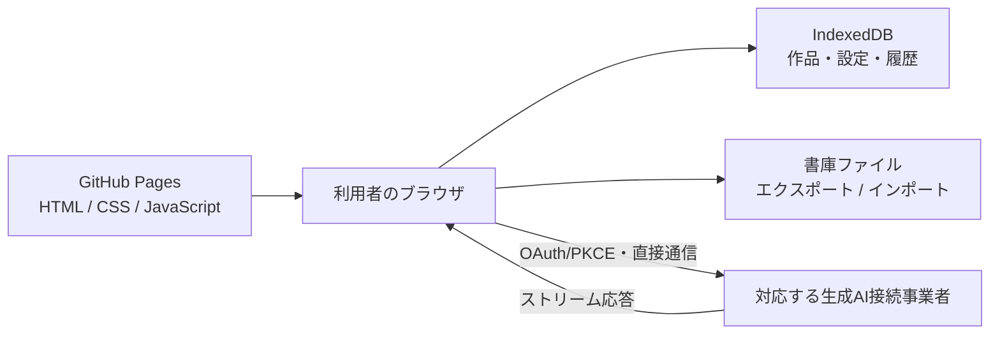

# ChapterFlow 公開 Web 版 設計書

作成日: 2026-07-27

最終方針変更: 2026-07-27

対象: GitHub Pages だけで動作する公開ベータ版

状態: **開発保留（期限未定）**。以下の設計は再開判断時の参考資料として保存する。

## 0. 結論

2026-07-27、公開Web版の実装をいったん停止し、現行Electron版の開発と品質向上を優先することを決定した。

- 公開Web版を現在の製品ロードマップ、リリース条件、CI必須条件から外す。
- 新しいWeb機能、GitHub Pagesデプロイ、BrowserStorage、OpenRouter接続の実装へ進まない。
- 現在の未コミットPhase 0実装は、この判断だけを理由に自動でコミット、削除、巻き戻ししない。扱いは11章で分類する。
- 本書は破棄せず、検討した制約と再開時の選択肢を残すための設計記録とする。
- 再開判断が明示されるまで、以下のPhase A〜Eと受け入れ基準は未着手の参考計画であり、Electron版の作業を止めない。

再開を検討するのは、少なくとも次のいずれかが具体化したときとする。

1. 自分以外の想定利用者と、Web版が必要な理由が明確になった。
2. サーバー型の運用費・認証・DBを引き受けるか、静的ローカル型の制約を受け入れるかを選べる状態になった。
3. Electron版とは別に、Web版を継続して保守する時間と公開後の問い合わせ窓口を確保できた。

再開する場合の第一候補は、運営者が API サーバー、認証、データベース、メール送信基盤を持たない**ローカルファーストの静的 Web アプリ**である。

- GitHub Pages は React/Vite の静的ファイルだけを配信する。
- 作品、設定、生成履歴は利用者のブラウザ内に保存する。
- ログイン、アカウント、クラウド同期、運営者によるバックアップは提供しない。
- 生成 AI にはブラウザから直接接続する。
- API キーを一般的な形でブラウザへ保存する方式は採用せず、初期公開ではブラウザ利用を公式に想定した OAuth/PKCE 接続を持つ事業者だけを対象にする。
- 利用者自身によるプロジェクト書庫のエクスポート／インポートを必須機能とする。
- 現行 Electron 版は壊さず、自分用のローカルアプリとして維持する。

この構成では、運営者に Web サーバーや DB の固定費は発生しない。独自ドメインを使う場合のドメイン費用と、利用者自身の生成 AI 利用料は別である。

## 1. 仕様上の仮定

- 公開ベータは、GitHub Pages の利用条件に適合する非商用の公開プロジェクトとして提供する。将来、課金または商用 SaaS として運営する場合はホスティングを再選定する。
- 課金、作品共有、共同編集、クラウド同期、運営者提供の生成 AI 利用枠は対象外とする。
- アカウントを作らず、メールアドレスなどの利用者情報を運営者が収集しない。
- 同じブラウザプロファイルを使える人は、保存された作品を閲覧できるものとする。OS アカウントをまたぐ秘密性は保証しない。
- 別端末や別ブラウザへの移動は、利用者が書庫をエクスポートしてインポートすることで行う。
- ブラウザデータは消去・破損・容量制限の影響を受け得る。運営者は復元できない。
- 初期サポートはデスクトップ版の最新 Chromium 系ブラウザを優先する。Safari、Firefox、モバイルは主要導線を確認するが、File System Access API などの任意機能は保証しない。
- 生成 AI の利用にはインターネット接続が必要である。作品の閲覧・編集については、将来 PWA のオフライン利用を可能にできる設計とする。
- ソースは Electron 版と同じリポジトリに置き、Web 版を別エントリ、別ビルド、別デプロイとして管理する。

## 2. 目的と非目標

### 2.1 目的

- インストールせず、URLを開くだけでChapterFlowの主要な執筆機能を試せるようにする。
- 作品を外部のChapterFlowサーバーへ送らず、利用者のブラウザ内で管理する。
- 運営者が認証、DB、Secret Manager、メール送信、常駐サーバーを保守しなくてよい構成にする。
- 利用者が自分のデータをバージョン付き書庫として退避・復元できるようにする。
- Electron版と同じ型、検証、プロンプト構築などの純粋ロジックを再利用する。
- Web版の変更がElectron版の保存先、ファイル形式、ビルド、GitHub Releasesへ影響しないようにする。

### 2.2 非目標

- ログイン、ユーザーアカウント、メール認証
- サーバーDBへの保存、複数端末の自動同期
- 運営者によるデータ復旧、アカウント削除受付
- 作品の公開URL、共有、共同編集
- サーバー側でのAPIキー保管、生成処理、ログ収集
- 実行中の生成を、タブを閉じた後も継続・再開すること
- すべての生成AI事業者をElectron版と同じ方式でサポートすること
- 課金、広告、アクセス解析、マーケティング用トラッキング
- GitHub Pagesの制約を回避する外部プロキシ、サーバーレス関数、隠れた常駐バックエンド

## 3. 現行Electron版との違い

| 領域 | Electron版 | 公開Web版 |
| --- | --- | --- |
| 配信 | Windowsアプリ | GitHub Pagesの静的ファイル |
| 実行場所 | Electron + PC内Node/Express | ブラウザだけ |
| 利用者 | PCの利用者 | ブラウザプロファイルの利用者 |
| 保存 | `Documents/ChapterFlow` 配下 | IndexedDBを正本とする |
| 保存先選択 | OSフォルダ選択 | 原則なし。書庫の入出力だけファイル選択を使う |
| 複数端末 | 手動でファイル移動 | 書庫のエクスポート／インポート |
| APIキー | PC内ファイルへ保存 | 初期版はOAuth/PKCEで接続し、長期永続化しない |
| AI接続 | ローカルNodeサーバーから接続 | ブラウザから対応事業者へ直接接続 |
| ストリーミング | ローカルAPI経由 | 対応事業者のHTTPストリームをブラウザで直接読む |
| バックアップ | PC内ファイルを退避可能 | 利用者が書庫をダウンロードする |
| 障害調査 | `crash.log` | 端末内の診断情報を利用者が明示的に書き出す |

## 4. 推奨アーキテクチャ



### 4.1 ソース構成

```text
既存ルート              Electron版。現行ビルドとファイル保存を維持
apps/web/               静的Web版のエントリ、ルーティング、PWA、Pages設定
src/client/             再利用可能なReact UI
src/shared/             型、スキーマ、検証、純粋ロジック
src/web/                BrowserStorage、ブラウザAI接続、書庫入出力
```

- Node組み込みモジュール、Express、Electron、ローカルパスをWebバンドルへ含めない。
- 現行`clientApi`はHTTP固定のまま流用せず、画面から呼ぶユースケース境界へ置き換える。
- Electron版はHTTP/ローカルサーバー経由、Web版はブラウザ内サービスを呼ぶ。それぞれのtransportをUIから隠す。
- 最初から全サービスを共通化しない。ブラウザで実行可能な純粋ロジックだけを小さく抽出する。

### 4.2 GitHub Pages配信

- Viteで静的ファイルを`dist-web/`へ生成し、GitHub ActionsからPagesへデプロイする。
- Project Pagesのサブパスでも動くよう`base`を設定する。初期版の画面遷移はHash Routerを推奨し、再読込時の404を避ける。
- ソース、ビルド成果物、Actions変数へAPIキーや秘密情報を入れない。公開されたJavaScriptは誰でも閲覧できるものとして扱う。
- GitHub Pagesでは任意のレスポンスヘッダーを設定できないため、可能なCSPはHTMLの`meta`で設定し、外部スクリプト、外部フォント、解析タグを使わない。
- 独自ドメインは任意とする。`github.io`ドメインでも全機能が動くことを基準にする。
- GitHub Pagesは静的サイト用であり、商用SaaSの無料ホスティングを目的としたものではない。提供形態が変わる場合は利用条件を再確認する。

## 5. ブラウザ内データ保存

### 5.1 正本とデータモデル

作品データの正本は`localStorage`ではなくIndexedDBとする。`localStorage`はテーマなど小さな非機密設定に限る。

| ストア | 用途 | 主なキー |
| --- | --- | --- |
| `app_meta` | DBスキーマ、アプリ版、移行状態 | `key` |
| `settings` | 既定モデル、通知、共通NG、プリセット | `key` |
| `projects` | 作品メタデータ、更新版 | `id` |
| `project_documents` | 世界設定、人物、記憶、状態、参考資料 | `[projectId, kind, id]` |
| `generation_records` | 生成結果、採否、エラー、途中状態 | `[projectId, id]` |
| `setup_sessions` | 作品化前の相談 | `id` |
| `roleplay_sessions` | ロールプレイ | `[projectId, id]` |

- サーバー利用者が存在しないため、`owner_user_id`は持たない。分離境界はWebオリジンとブラウザプロファイルである。
- 各保存物に`schemaVersion`、`createdAt`、`updatedAt`、必要な`revision`を持たせる。
- 複数ストアを更新する操作はIndexedDBトランザクションで確定する。
- スキーマ移行は前方移行とし、失敗時に旧データを読めなくしない。破壊的移行前には端末内スナップショットを作る。

### 5.2 複数タブ

- 対応ブラウザではWeb Locks APIで作品単位の書き込みを直列化する。
- BroadcastChannelで保存完了とrevision変更を他タブへ通知する。
- Web Locks APIが使えない場合もrevisionを検査し、古い画面からの上書きを拒否する。
- 競合時は編集中の入力を保持し、再読込、コピー、別名保存を提示する。

### 5.3 容量と永続性

- 起動時に`navigator.storage.estimate()`で使用量と上限を確認し、容量逼迫を表示する。
- 対応ブラウザでは`navigator.storage.persist()`を要求できる導線を用意する。ただし永続化を保証しない。
- プライベートブラウズ、ブラウザデータ削除、端末故障では消失することを初回起動時と設定画面に明示する。
- 参考資料には1件サイズとプロジェクト合計サイズの上限を置く。初期値は実装時に実ブラウザで測定して決める。

## 6. 保存、ダウンロード、バックアップ

### 6.1 通常保存

- 編集はIndexedDBへ自動保存し、「保存中／この端末に保存済み／保存失敗」を表示する。
- 「保存済み」の表現だけでクラウド保存と誤認させない。
- 生成中の部分結果は一定間隔で下書きとして保存する。完了、失敗、利用者による中断を区別する。
- タブを閉じる、再読込する、ブラウザが停止する場合、外部AI処理の継続は保証しない。

### 6.2 書庫のエクスポート

- プロジェクトごとのZIPと、全データをまとめたバックアップ書庫を提供する。
- 書庫には`manifest.json`を含め、`exportFormatVersion`、アプリ版、出力日時、作品一覧、各ファイルのチェックサムを記録する。
- 作品、設定、人物、世界観、記憶、参考資料、エピソード、必要な生成履歴を含める。
- AI接続トークン、ブラウザ内部情報、診断ログは含めない。
- 通常ダウンロードを必須の共通方式とする。File System Access APIは対応ブラウザだけの追加機能とする。
- 最終バックアップ日時を端末内に記録し、一定期間または一定回数の編集後に退避を促す。

### 6.3 インポートと復元

- 利用者が明示的に選択した書庫だけを読み込む。
- ZIP内のパス、形式、サイズ、件数、チェックサム、参照整合性を保存前に検証する。
- 同じ作品IDがある場合は「置換」「コピーとして追加」「中止」を選べるようにし、既定はコピーとする。
- インポート全体をトランザクションで確定し、失敗時に一部だけ残さない。
- 未知の将来バージョンは破壊的に読み込まず、対応していないことを表示する。
- Electron版との相互移行は同じmanifestの考え方を使うが、Electronの任意フォルダ構造やローカルパスをWebへ持ち込まない。

## 7. 認証と利用者データの分離

ChapterFlow自身の認証、セッション、ユーザーアカウントは実装しない。

- データはGitHubやChapterFlow運営者のアカウントには紐付かない。
- 同じ端末でも、ブラウザやブラウザプロファイルが違えば別データになる。
- 同じブラウザプロファイルを共有する人同士のアクセス制御はできない。
- GitHubへログインしているかどうかは作品保存に影響しない。
- 「ログアウト」「全端末ログアウト」「アカウント削除」は存在しない。代わりに「このブラウザのChapterFlowデータをすべて消去」を提供する。
- 全消去は直前の書庫エクスポートを案内し、二段階確認を要求する。

生成AI接続事業者のOAuth画面はChapterFlowのログインではない。接続解除後も作品データは端末に残る。

## 8. 生成AI接続と秘密情報

### 8.1 初期公開の方針

GitHub Pagesだけで完結するため、ChapterFlowのバックエンド代理通信は置かない。初期公開では、ブラウザ向けOAuth/PKCEと直接API通信を公式に提供する接続先だけをサポートする。

第一候補はOpenRouterのOAuth/PKCEとする。OpenRouterは公開クライアントからPKCEで利用者管理のキーを取得し、ブラウザから利用するフローを文書化している。これによりChapterFlow運営者は共通APIキーを持たず、利用者はOpenRouter側でモデルと利用額を管理できる。

- PKCEの`code_verifier`は認可開始から交換完了まで`sessionStorage`に保持する。
- 交換後の接続トークンは初期版ではメモリまたは`sessionStorage`にだけ置き、ブラウザを閉じた後まで永続化しない。
- 接続解除時は端末内トークンを削除し、事業者側での失効方法も案内する。
- 利用者には、支出上限と期限を設定した専用キーの使用を推奨する。
- トークンを作品書庫、URL、ログ、例外メッセージへ含めない。

### 8.2 Electron版の既存事業者との違い

Electron版が対応するOpenAI、Gemini、DeepSeek、xAIなどの一般APIキーを、公開Web版でそのまま入力・保存する機能は初期公開に含めない。

OpenAIとGeminiの公式なセキュリティ指針は、本番のブラウザへAPIキーを置かずバックエンド経由にすることを求めている。利用者自身のキーであっても、ブラウザ拡張、XSS、端末共有、DevToolsから取得される危険をChapterFlow側で解消できない。CORSが許可されない事業者も、静的サイトからは回避できない。

将来ほかの事業者を追加する条件は次のすべてを満たすこととする。

1. ブラウザ利用を事業者が公式にサポートしている。
2. クライアントシークレットを必要としないOAuth/PKCE等がある。
3. GitHub PagesのオリジンからCORSを含む実機試験が通る。
4. トークンの失効、期限、支出上限を利用者が管理できる。
5. 作品内容が送信される相手とデータ利用条件を画面で説明できる。

### 8.3 ストリーミング

ChapterFlowサーバーからのSSEは廃止する。ブラウザがOpenRouter等のストリーミングHTTP応答を直接読み、進捗と本文を表示する。

- `done`、利用者キャンセル、通信失敗を区別する。
- 部分結果をIndexedDBへ定期保存する。
- ページ離脱時に処理が失われ得ることを生成中に表示する。
- ストリーム非対応または不安定な場合は、一括応答へフォールバックできるようにする。
- 外部ホスティングのSSE耐久試験は不要になる。代わりに、GitHub Pages上から接続事業者へのCORS、ストリーム、キャンセル、再試行をE2Eで検証する。

## 9. Webセキュリティとプライバシー

- 実行時に第三者スクリプト、広告、アクセス解析、タグマネージャーを読み込まない。
- npm依存はビルド時に固定し、依存監査とlockfile差分をCIで確認する。
- CSPを可能な範囲で厳格化し、`connect-src`はGitHub Pages自身と採用したAI接続先だけを列挙する。
- Markdown、AI応答、インポート内容をHTMLへ表示するときはサニタイズし、任意スクリプトを実行させない。
- APIトークンや作品内容をURL、console、エラー収集サービスへ出さない。
- ブラウザ拡張、マルウェア、共有OSアカウントからの窃取は防御範囲外であることを明示する。
- 生成時に送信される作品内容、OpenRouterと実モデル事業者の関係、各事業者の保存方針を接続前に説明する。
- ChapterFlow運営者は作品を受信・復旧できないことをプライバシー説明に明記する。
- セキュリティ上の問題を報告する連絡先をリポジトリに用意する。作品やAPIキーをGitHub Issueへ貼らないよう案内する。

GitHub Pagesではサーバー側の任意セキュリティヘッダーを設定できないため、静的サイト側の対策だけで足りない要件が生じた場合は、Pagesだけで完結する方針を再検討する。

## 10. Electron／サーバー機能の無効化・置換

| Electron／現行サーバー機能 | 公開Web版での扱い |
| --- | --- |
| Node/Express API | 使用しない。ブラウザ内ユースケースへ置換 |
| `BrowserWindow`、位置保存 | ブラウザに委ねる |
| `app.quit`、再起動API | 削除。再読込案内へ置換 |
| データディレクトリ操作 | 削除。IndexedDBと書庫入出力へ置換 |
| OSフォルダ選択 | 書庫の読込・保存時だけ任意利用 |
| Windowsショートカット | 削除。必要ならPWA導線を提供 |
| LANトークン、CORS自動許可 | 使用しない |
| サーバーrequestId、アクセスログ | 使用しない。端末内診断書き出しへ置換 |
| サーバーSSEプローブ | 使用しない。接続事業者とのブラウザE2Eへ置換 |
| `credentials.json` | Web版では使用しない |
| ファイルロック | Web Locks APIとrevisionへ置換 |
| デスクトップ通知 | 画面内通知。Web Notificationsは明示許可時だけ |

公開Webビルドには、データディレクトリ、終了、再起動、ショートカット、LANトークンに関するUI・ルート・Nodeコードを含めない。

## 11. Phase 0実装の扱い

サーバー／DB型Web版を前提に作られたPhase 0実装は、保留判断の時点では未コミットである。既存の利用者変更を壊さないため、この設計書更新ではコードを削除・巻き戻し・ステージしない。

### 設計記録として残すもの

- 本設計書
- `公開Web版_移行インベントリ.md`。ただしサーバー／DB型設計時点の履歴であり、現行の実装計画ではないことを明示して扱う。
- Phase 0で判明したElectron依存、ストレージ直接import、ローカルパス依存の知見

これらは実行コードではなく、将来の判断材料として価値がある。

### Electron版だけでも採用価値を再評価できるもの

- `tests/integration/apiResponseContract.test.ts`のAPI形状・エラー応答テスト
- `src/server/storage/`の保存操作一覧と、`tests/unit/projectStorageContract.test.ts`の保存形式互換テスト

API契約テストはElectronの回帰防止にも使える。一方、68メソッドのストレージ契約、registry、固定`UserContext`、3サービスの差し替えは、Web版を止めた状態では抽象化コストの方が大きい可能性がある。次のElectron向け機能が実際に必要になるまで、初期判断は**取り下げ候補**とする。

- Electronで保存形式を複数持つ
- テスト用のインメモリ保存へ差し替える
- データ移行や修復処理のため、保存I/Oを明確に分離する

採用する場合も、Web所有権のための`UserContext`ではなくElectron上の具体的な必要性を改めて設計し、Web版変更とは別コミットにする。

### Web専用の取り下げ候補

- `apps/web/`のExpress起動系、health API、501 API、SSE probe
- `scripts/build-web.mjs`
- `scripts/sse-endurance-check.mjs`
- `scripts/web-portability.mjs`
- `tests/web/`
- `tests/unit/webPortability.test.ts`
- `.github/workflows/ci.yml`の`web`ジョブ
- `package.json`の`web:*`と`sse:endurance`スクリプト
- `vitest.config.ts`の`tests/web`追加
- `.gitignore`の`dist-web`追加

これらはElectron版の機能や回帰防止に直接寄与しないため、Web版を再開しないなら取り下げるのが最も単純である。ただし実際の取り下げは、対象差分を再確認し、設計書など残すものと分けたうえで別途行う。

### 現時点の推奨着地

1. 設計書と調査知見は残す。
2. Web専用コード・CI・スクリプト・テストは取り下げる。
3. ストレージ契約と3サービスの変更も、Electron単独の具体的用途がなければ取り下げる。
4. API契約テストだけは、Web向けコメントをElectronの回帰目的へ直して独立採用する余地を残す。
5. 取り下げ後にElectron版の型検査、921件のテスト、ビルド、E2Eを再実行し、元の状態へ戻ったことを確認する。

## 12. 段階的移行計画

> 開発保留中は実行しない。公開Web版の再開を明示的に決定した場合だけ、現在のコードと外部サービスの仕様を再調査して更新する。

### Phase A: 方針転換と境界更新

- 本設計を正本として、サーバー／DB前提の未実装計画を停止する。
- 静的Webエントリ、Viteビルド、GitHub Pagesデプロイを作る。
- WebバンドルへのNode、Express、Electron混入をCIで拒否する。
- Electron版の全テスト、ビルド、Windowsパッケージ検証を維持する。
- 旧Phase 0コードは、代替が確認できるまで隔離して残す。

**完了条件**: GitHub Pages相当のサブパスで静的画面が起動し、Electron配布物と保存先が変わらない。

### Phase B: BrowserStorageと主要編集機能

- IndexedDBスキーマ、トランザクション、マイグレーションを実装する。
- ProjectStorageの操作をBrowserProjectStorageへ対応付ける。
- 作品一覧、作成、編集、削除、人物、世界観、記憶、参考資料を移す。
- 保存状態、容量警告、複数タブ競合、全消去を実装する。

**完了条件**: ブラウザ再起動後も作品を再開でき、別ブラウザプロファイルにはデータが現れない。

### Phase C: 書庫と復旧

- プロジェクトZIP、全データバックアップ、manifest、チェックサムを実装する。
- インポート検証、コピー取込、将来バージョン拒否を実装する。
- 破壊的操作とDB移行前の退避導線を実装する。

**完了条件**: 新しいブラウザプロファイルへ書庫を移し、作品内容と主要設定が一致する。

### Phase D: ブラウザAI生成

- OpenRouter OAuth/PKCEの実現性をGitHub Pages上で検証する。
- ブラウザ用モデル接続、ストリーミング、キャンセル、エラー分類を実装する。
- プロンプト構築、NG検査、生成後メンテナンスの純粋ロジックを移す。
- XSS、CSP、トークン混入、CORSの負のテストを行う。

**完了条件**: 運営者の秘密情報なしで利用者が接続し、生成結果がIndexedDBへ保存され、トークンが書庫・URL・ログへ残らない。

### Phase E: 公開ベータ

- PWA、オフライン用アプリシェル、更新通知を必要な範囲で追加する。
- 対応ブラウザ、データ消失リスク、バックアップ方法、AI送信先を画面とREADMEに明記する。
- 少人数テストでアップグレード、容量、書庫復元を確認する。
- GitHub Pagesへ公開し、Electron版のリリース手順から独立して更新できるようにする。

**完了条件**: 受け入れ基準を満たし、サーバー、DB、認証、メール送信の契約なしに公開できる。

## 13. 主なリスクと対策

| リスク | 影響 | 初期対策 |
| --- | --- | --- |
| ブラウザデータ消去 | 作品を完全に失う | 書庫必須、定期リマインド、persist要求、明確な警告 |
| XSSや拡張機能によるトークン窃取 | 利用者のAI利用料被害 | OAuth/PKCE、セッション限定、支出上限、CSP、サニタイズ、第三者スクリプト禁止 |
| 事業者がブラウザ利用を変更 | 生成機能が停止 | 初期接続先を限定、実機契約テスト、機能フラグ、一括応答フォールバック |
| CORSで直接APIを呼べない | 対象事業者を利用不能 | 公式ブラウザフローのある事業者だけを採用し、独自プロキシで回避しない |
| タブ終了で生成が失われる | API利用料だけ発生し結果が残らない | 生成中警告、部分保存、ページ離脱確認、短い処理単位 |
| IndexedDBの容量差 | 大きい資料を保存できない | 容量表示、上限、テキスト中心、書庫退避 |
| 複数タブ競合 | 編集内容を上書き | Web Locks、revision、BroadcastChannel、別名保存 |
| GitHub Pagesの制約変更 | 公開継続不能 | 静的成果物を別ホストへ移せるビルド、独自ドメイン任意 |
| 共有PCで作品が見える | プライバシー問題 | ローカル保存の説明、ブラウザプロファイル分離、全消去 |
| Electron版の回帰 | 自分用アプリが壊れる | 別エントリ・別CI、Electronパッケージ検証 |

## 14. 未決定事項

Phase B開始前に決める。

1. 初期サポートブラウザを「最新Chrome/Edge」に限定するか、Firefox/Safariも同時に保証するか
2. IndexedDB実装を直接行うか、Dexie等の薄いラッパーを使うか
3. 参考資料、生成履歴、全体DBの暫定容量上限
4. 複数タブ競合時の既定操作を「再読込」「コピー作成」のどちらにするか

Phase D開始前に決める。

5. OpenRouter OAuth/PKCEを初期唯一のAI接続にするか
6. 接続トークンをメモリだけにするか、`sessionStorage`まで許可するか
7. 初期公開で利用可能にするモデル範囲と支出上限の案内
8. ストリーム失敗時に一括応答へ自動フォールバックするか

公開前に決める。

9. `github.io`のまま公開するか、独自ドメインを使うか
10. Electron版データをそのまま読めるインポート変換を初回公開に含めるか
11. バックアップ推奨頻度と警告を再表示する条件
12. 不具合・セキュリティ報告の窓口

認証事業者、PostgreSQL、Secret Manager、メール送信事業者、サーバーホスティング、サーバーSSE、PITR、RPO/RTOは、この構成では決定不要である。

## 15. 公開ベータの受け入れ基準

> 開発保留中の完了条件ではない。再開後の設計レビューで有効性を確認してから使用する。

### 配信と境界

- [ ] GitHub PagesのProject Pagesサブパスから直接起動・再読込できる。
- [ ] Web成果物にNode、Express、Electron、ローカルパス操作が含まれない。
- [ ] Web成果物、ソース、Actions設定にAPIキーや秘密情報が含まれない。
- [ ] Web版のビルド・公開失敗がElectron版のビルドとReleasesを妨げない。

### 保存と復旧

- [ ] 作品の作成、一覧、再開、編集、削除がブラウザ内で完了する。
- [ ] ブラウザ再起動後に保存済み作品を再開できる。
- [ ] 保存中、端末保存済み、保存失敗を区別して表示する。
- [ ] 容量不足、プライベートブラウズ、永続化拒否を利用者へ説明できる。
- [ ] 複数タブの競合で入力を無言で上書きしない。
- [ ] プロジェクト書庫と全体バックアップをダウンロードできる。
- [ ] 新しいブラウザプロファイルへ書庫をインポートし、主要データが一致する。
- [ ] 壊れた書庫、過大な書庫、未知の将来バージョンを安全に拒否する。
- [ ] 全データ消去は二段階確認され、AI接続トークンも端末から消える。

### AI接続

- [ ] GitHub Pages上からOAuth/PKCEを完了でき、クライアントシークレットを必要としない。
- [ ] 生成、ストリーミング表示、キャンセル、一括応答フォールバックが検証されている。
- [ ] 生成途中の部分結果が一定間隔で端末保存される。
- [ ] ページ離脱時に生成が失われ得ることを警告する。
- [ ] AI接続トークンがURL、console、書庫、診断情報へ含まれない。
- [ ] 接続解除後に再生成できず、作品データは端末に残る。
- [ ] 利用者に送信先、モデル事業者、料金負担、支出上限を説明する。

### セキュリティと品質

- [ ] AI応答、Markdown、インポート内容から任意スクリプトを実行できない。
- [ ] CSPの`connect-src`が必要な接続先だけに限定されている。
- [ ] 実行時の第三者解析スクリプトと広告がない。
- [ ] Electron版の型検査、テスト、起動、既存データ読込、Windowsパッケージ生成が従来どおり成功する。
- [ ] 対応ブラウザ、ローカル保存の限界、バックアップ手順、問い合わせ先が公開されている。

## 16. 参考にする外部制約

- GitHub PagesはHTML、CSS、JavaScriptを配信する静的ホスティングであり、Node/Expressを実行しない: <https://docs.github.com/en/pages/getting-started-with-github-pages/what-is-github-pages>
- GitHub Pagesには用途と容量・帯域等の制限がある: <https://docs.github.com/en/pages/getting-started-with-github-pages/github-pages-limits>
- OpenRouterは公開クライアント向けOAuth/PKCEと、ブラウザで利用者管理キーを使うフローを文書化している: <https://openrouter.ai/docs/guides/overview/auth/oauth>
- OpenAIはAPIキーをブラウザへ配置せず、バックエンド経由にするよう案内している: <https://help.openai.com/en/articles/5112595-best-practices-for-api>
- Geminiも本番のクライアント側へAPIキーを置かず、バックエンドプロキシを使うよう案内している: <https://ai.google.dev/gemini-api/docs/api-key>

## 17. 実装開始時の注意

- 「GitHub Pagesだけで完結」を守るため、都合のよいCORSプロキシ、無料サーバーレス関数、運営者共通APIキーを暫定追加しない。
- ブラウザで安全に扱えない既存AI事業者を、Electron版と同じに見せるためだけに有効化しない。
- IndexedDBをサーバーDBと同程度に安全・永続と説明しない。利用者バックアップを製品の中心導線にする。
- APIトークンを暗号化してIndexedDBへ置くだけで「安全に保存できた」と判断しない。復号鍵も同じブラウザに置けばXSSへの防御にならない。
- 旧Phase 0コードを削除する変更と、静的Web版を動かす変更を同じ大きなコミットにしない。
- Electron版の保存先や既存ファイルを、Web版の都合で変更しない。
- 公開前にGitHub Pages上の実URLから、OAuthリダイレクト、CORS、ストリーム、書庫ダウンロード、PWA更新を確認する。
